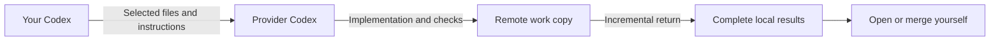

<div align="center">

<h1>
  <picture>
    <source media="(prefers-color-scheme: dark)" srcset="docs/assets/wordmark-dark.svg">
    
  </picture>
</h1>

**Delegate work to Codex on another computer, from your current conversation.**

Pair devices over your local network. Continue the same task. Bring complete results home.

[](CHANGELOG.md)
[](https://nodejs.org/)
[](LICENSE)
[](#current-limitations)

[简体中文](README.md) · **English**

[Get started](#quick-start) · [Installation](docs/install.en.md) · [Usage](docs/usage.en.md) · [Issues](https://github.com/mekoand/sub2sub/issues)

</div>

---

sub2sub is a Codex plugin for delegating a selected work copy and task to an authorized peer computer. The provider's Codex executes the work; your computer receives a complete local copy of the results. Follow-up instructions resume the same native conversation.

Use it for a clearly scoped implementation, document, or analysis task that another device can complete within its execution environment. Each side manages its own login. Routine pairing uses a private invitation rather than an SSH password, and there is no central coordination service.

> **0.4.3 is experimental.** macOS and Windows have real-device validation; Linux has not been validated end to end. The integration uses experimental Codex permission APIs. **Each provider runs one task at a time, with a fixed 30-minute limit per turn.**

## What it does

| Capability | Behavior |
| --- | --- |
| Invitation pairing | Connect using a single-use, 10-minute invitation |
| Same-task follow-ups | Reuse the remote work copy and native conversation |
| Scoped file transfer | Preview the destination, selected file count, and size before transfer |
| Incremental results | Transfer changes since the last confirmed save; keep a complete local copy |
| Separate role settings | Callers choose defaults; providers control offered models and retention |
| Recoverable cleanup | Restore a cleaned work copy from saved local files and resume its conversation |
| Local result access | Open saved results while the provider is offline; source files are never overwritten automatically |

## An example conversation

These are illustrative prompts, not an execution transcript.

```text
Provider: Create a sub2sub invitation for my other computer.
Caller:   Pair this invitation as work-computer: sub2sub:…
Caller:   Delegate these project documents to work-computer.
          Build an offline introduction page and run the relevant checks there.
Caller:   Continue that task and improve the mobile layout.
Caller:   Show the latest saved results.
Caller:   Results are confirmed. Finish and clean the remote work copy,
          keeping the ability to continue later.
```



Quality checks belong to the delegated task. The caller verifies that the main turn completed and required deliverables were saved and are readable. A provider task does not inherit every plugin or desktop capability available on the provider's machine.

## Quick start

### Requirements

- Codex with native plugins and the required App Server permission APIs; real-device testing currently uses Codex 0.152.x.
- Node.js **22+** and Git to obtain the source.
- The provider signed into Codex with its own ChatGPT account. API-key mode is not used for delegated execution.
- **OpenSSL on PATH** when the provider first creates a sharing identity.
- Direct connectivity over a private IPv4 network. Allow inbound traffic to the selected provider port, **47631** by default.

There are no third-party npm runtime dependencies and no `npm install` step. Model requests still use the provider's Codex service; this is not an offline inference system.

```sh
git clone https://github.com/mekoand/sub2sub.git
cd sub2sub
```

Follow the [platform installation guide](docs/install.en.md) to prepare a package, check the environment, and install from a local marketplace. Prepare Windows packages on the target machine so they reference its actual Node executable. Start a **new Codex conversation** after installation.

This release uses a source-based installation flow. It does not claim availability in the universal public plugin directory. Installation, daily usage, and troubleshooting guides are available in both Chinese and English.

### Pair and delegate

1. Ask the provider to generate an invitation and keep its sharing process running.
2. Share the invitation privately. It expires after **10 minutes**, works once, and is replaced when a new invitation is generated.
3. Paste it on the caller, name the connection, and confirm the task-file transfer scope.
4. Delegate a clear task, review the input preview, and collect results after each completed phase.

If a model or reasoning effort is unavailable or disallowed, sub2sub lists valid choices and waits. It does not silently substitute a model.

## Settings

| Role | Everyday settings | Advanced settings |
| --- | --- | --- |
| Caller | Shared default model and reasoning effort; per-task overrides | Input/result byte and file limits |
| Provider | All currently available models or an explicit allowlist | Transfer limits and retention days |

The code default for new callers is `gpt-5.6-luna / max`; actual account availability is checked before dispatch. Changing defaults affects new tasks only. A provider choosing “all” also includes models that become available later.

Input and result defaults are **20 MiB / 2,000 files** each. Input limits cover the complete uploaded copy; result limits cover changed files. Both sides' limits apply, using the smaller value. Advanced limits support up to 64 MiB / 10,000 files.

## Results and task lifecycle

Each saved phase produces a complete local task copy and a text response. Viewing results reads that local save without contacting the provider. During an unsaved follow-up, existing local results are explicitly an earlier version.

| Choice | Effect |
| --- | --- |
| `keep` | Keep the task under its existing retention deadline; do not extend it |
| `workcopy` | Remove remote work files and transfer payloads; preserve native history and restoration metadata |
| `records` | Also remove sub2sub task records; automatic restoration is no longer available |
| `all` | Also remove the associated native conversation and derived sub-conversations |

The default retention is **7 idle days after the latest turn ends**. Cleanup requires confirmed local saving of necessary results and no active or unknown execution. Checks run while sharing is active; a sleeping or offline device does not guarantee an exact cleanup time. Local results and source files remain untouched.

Deleting a connection loses its association with old tasks. Pairing the same device again does not restore that association, though local deliverables remain accessible.

## Current limitations

- Private **IPv4 LAN** only. No public relay, IPv6, automatic discovery, device queue, or login auto-start.
- One active task per provider; **30 minutes per turn**. Split long work into phases. After a timeout, inspect and resume the original task instead of duplicating it.
- Work-copy scope only. Task network access, web search, MCP, apps, and browser integrations are disabled. Work needing dependency downloads or additional host access may not complete.
- The sharing process must stay alive. Stopping new task acceptance differs from exiting the process, which interrupts execution.
- Generated caches and browser profiles can exceed transfer limits. Implementation completion alone is not delivery completion.
- Windows requires a native `codex.exe` and a desktop login session. SSH system sessions and browser startup have observed environment limitations.
- File operations remain subject to the Codex sandbox and host approvals; the plugin does not automatically expand permissions.

See [validation scope](docs/validation.md) for the distinction between automated tests, real-device evidence, and unverified behavior.

## Packaging

From the source repository root, with no npm dependencies to install:

```sh
npm run package -- /absolute/new/location/sub2sub
```

The parent directory must exist and the target must be new. The package includes the plugin, bilingual guides, and license. Running on the target Windows device uses its actual Node path. See the [installation guide](docs/install.en.md) for registration and installation.

## Development

```sh
# macOS / Linux source checks; no real subscription is invoked
npm run check
npm test

# Focused Windows platform regression
node --test test/platform.test.mjs
```

Tests use isolated state, loopback connections, and simulated Codex protocol endpoints. Real-subscription smoke tests are separate, explicit operations and are not run by CI.

The code uses native ESM and Node built-ins. `bin/` contains entry points, `lib/` contains runtime and protocol logic, and `skills/sub2sub/` contains conversational workflows. See [architecture](docs/architecture.md) and [contributing](CONTRIBUTING.md).

Issues and focused pull requests are welcome. Include reproducible steps, platform, and versions. Do not post invitations, pairing tokens, or complete state directories.

## Documentation

[Install and update](docs/install.en.md) · [Usage](docs/usage.en.md) · [Troubleshooting](docs/troubleshooting.en.md) · [Architecture](docs/architecture.md) · [Validation](docs/validation.md) · [Changelog](CHANGELOG.md)

## License

[MIT](LICENSE) © 2026 mekoand.

sub2sub is an independent community project and is not affiliated with OpenAI. Codex and ChatGPT belong to their respective owners.
