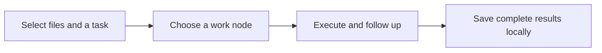

<div align="center">

<h1>
  <picture>
    <source media="(prefers-color-scheme: dark)" srcset="docs/assets/wordmark-dark.svg">
    
  </picture>
</h1>

**Send the task to the right device.**

Task delegation for teams and people who work across computers.

[](https://github.com/mekoand/sub2sub/actions/workflows/ci.yml)
[](CHANGELOG.md)
[](LICENSE)

[简体中文](README.md) · **English** · [Install](docs/install.en.md)

</div>

sub2sub lets you send a task and its working files to another computer from your current conversation. The work runs there, and the results come back to you. Follow-up requests keep the same files and conversation context.

## For your team. For your own computers.

**Share a work node with teammates.** Members can make a device available for others to use on selected tasks. Its owner decides when to accept work and which models to offer. The caller supplies the goal and files, then receives the results. Connections can be reused, and each person manages their own login.

**Put your computers to work together.** Ask for a code change, a documentation update, or a data-processing task from your laptop and send it to your desktop. Stay in the same conversation to review the result or request changes. Saved files open locally.

Each node runs one task at a time. You choose the destination. sub2sub works well for self-contained jobs with clear inputs and deliverables.

## Keep working on the same task

For example, send project documentation to a device named `workstation`:

```text
Send the docs directory to workstation. Build an offline help site and check its links.

Continue that task. Add search and a mobile layout.

Save the latest results, finish the task, and clean up its remote work copy.
```

The first transfer sends your selected files. Follow-ups reuse the remote work copy, and completed phases return only what changed. You receive complete local files and a written response. You decide when to merge the work into your source project.



## Get started

The current package integrates with **Codex**. Both devices need Codex, Node.js 22+, and Git. The device executing tasks signs in with its own ChatGPT account and uses OpenSSL to create its initial sharing identity. Devices connect over a local network; the default port is `47631`.

```sh
git clone https://github.com/mekoand/sub2sub.git
cd sub2sub
```

Follow the [macOS / Windows installation guide](docs/install.en.md) on both devices. Then, in your conversation:

1. Ask the work node to generate a sub2sub invitation and share it privately with the caller.
2. Paste the invitation on the calling device, name the connection, and confirm the task-file transfer scope.
3. Choose that device and describe the work. Once the results arrive, continue the task or finish it.

Invitations last 10 minutes and work once. Later tasks reuse the paired connection.

## Settings and results

Callers share one default model and reasoning-effort setting across nodes, with overrides for individual tasks. Node owners can offer all available models or a selected list. Ask in the conversation to see available devices, task status, or sharing settings.

Each saved result includes a complete local work copy that remains available when the node goes offline. Input and individual result transfers each default to 20 MiB and 2,000 files and can be changed in advanced settings.

Remote work copies become eligible for cleanup after 7 idle days following the last turn, once the results are confirmed saved and execution has stopped. You can also finish and clean up explicitly. Keeping the task record and native conversation lets you restore the local copy and resume later. See the [usage guide](docs/usage.en.md) for retention, restoration, and deletion options.

## Connections and execution

- Devices connect directly over a private IPv4 network. The work node's sharing process stays running.
- Each node executes one task at a time, with up to 30 minutes per turn. Longer work can continue in phases.
- Tasks run in a separate work copy. Task network access, MCP, app, and browser integrations are disabled in the current execution environment. Work uses the selected files and available local tools.
- Two-device workflows have been validated on macOS and Windows. See [installation requirements](docs/install.en.md) and [validation records](docs/validation.md) for platform details and test coverage.

## Packaging and development

sub2sub uses Node.js built-ins and has no third-party npm runtime dependencies. Package it from the source repository root:

```sh
npm run package -- /absolute/new/location/sub2sub
```

The parent directory must exist and the target must be new. Prepare Windows packages on the destination device so they use its actual Node path. The [installation guide](docs/install.en.md) covers installation, updates, and removal.

Development checks on macOS / Linux:

```sh
npm run check
npm test
```

Windows platform checks:

```powershell
node --test test/platform.test.mjs
```

Read the [architecture notes](docs/architecture.md) for the module layout and the [contribution guide](CONTRIBUTING.md) before submitting changes. For bug reports, include reproduction steps, platform, and versions. Remove invitations and personal configuration first.

[Usage](docs/usage.en.md) · [Troubleshooting](docs/troubleshooting.en.md) · [Changelog](CHANGELOG.md) · [Issues](https://github.com/mekoand/sub2sub/issues)

[MIT](LICENSE) © 2026 mekoand
