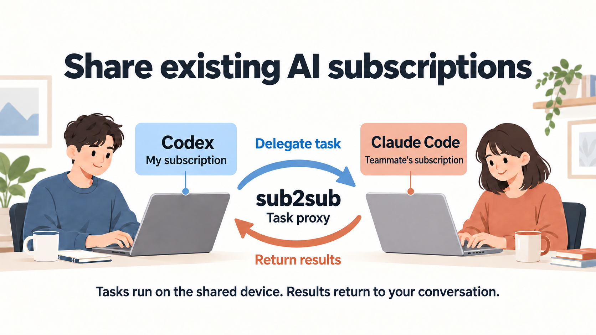

<div align="center">

<h1>
  <picture>
    <source media="(prefers-color-scheme: dark)" srcset="docs/assets/wordmark-dark.svg">
    
  </picture>
</h1>

**Share Codex and Claude Code subscriptions across devices, task by task, without sharing account credentials.**

Support for more tools is in development.

[](https://github.com/mekoand/sub2sub/actions/workflows/ci.yml)
[](CHANGELOG.md)
[](LICENSE)

**English** · [简体中文](README.zh-CN.md) · [Install](docs/install.en.md) · [Usage](docs/usage.en.md) · [Contribute](CONTRIBUTING.md) · [Security](SECURITY.md)

</div>

sub2sub is a task proxy for sharing existing AI subscriptions across your devices and team.

Delegate from your current conversation. An authorized device runs the task and returns responses and files; follow up in the same conversation. Each owner controls who can connect and which tools and models they share.



[Install the plugin](#install), [connect two devices](#connect-your-work-nodes), and [try your first task](#try-one-small-task).

## What you can do

- **Choose shared resources.** Select tools and models from connected devices and query remaining Codex quota. Optional [automatic host selection](docs/usage.en.md#automatic-host-selection) follows your candidate order for new tasks; submitted tasks stay on their original device.
- **Set sharing rules.** Choose authorized clients, models, concurrency limits, access expiry and optional Token budgets. Stop accepting new tasks at any time. [Sharing rules](docs/usage.en.md#sharing-rules-per-connection)
- **Collect results and request revisions.** Send selected files, receive a complete work copy, and continue the same task. Decide when to apply changes to your project.
- **Review resource usage.** See task distribution, execution time, models and Token usage, with export support. [Management and statistics](docs/usage.en.md#local-management-and-statistics)

Suitable tasks include organizing documents, building offline pages and editing code. Tasks run in separate work copies with task network access, MCP, app and browser integrations disabled. [Execution scope and environment requirements](docs/usage.en.md#delegate-and-follow-up) · [Session visibility](docs/usage.en.md#delegated-session-visibility)

## Install

Install on both devices. Choose the app where you will use sub2sub and sign in first; the Host can choose its execution tool separately. Packages include Node, with no npm setup needed.

### Ask your AI to install it

Send this to your Codex or Claude Code conversation:

> Follow https://github.com/mekoand/sub2sub to install the latest stable sub2sub release for my current app. Confirm the version and enabled status, then explain how to restart and get started.

Or install manually below.

### Codex

**macOS · Terminal** (Apple Silicon or Intel, detected automatically)

```sh
/bin/bash -o pipefail -c 'curl -fsSL https://github.com/mekoand/sub2sub/releases/latest/download/install.sh | /bin/bash'
```

**Windows x64 · PowerShell**

```powershell
irm https://github.com/mekoand/sub2sub/releases/latest/download/install.ps1 | iex
```

After installation, **fully quit and reopen Codex Desktop**, or exit and restart Codex CLI.

### Claude Code

**macOS · Terminal** (Apple Silicon or Intel)

```sh
/bin/bash -o pipefail -c 'curl -fsSL https://github.com/mekoand/sub2sub/releases/latest/download/install.sh | /bin/bash -s -- claude'
```

**Windows x64 · PowerShell**

```powershell
& ([scriptblock]::Create((irm https://github.com/mekoand/sub2sub/releases/latest/download/install.ps1))) -Target claude
```

Start a **new Claude Code session** after installation. Devices that only send tasks do not need Codex. Claude Code Hosts currently require macOS; Windows can act as a Client. [Requirements and custom paths](docs/install.en.md#claude-code)

### Confirm that it loaded

After restarting, ask:

> Show sub2sub status and version without changing settings.

Confirm the loaded version and review the first-use settings. Enable sharing when you are ready to receive tasks.

To update, say “Upgrade sub2sub” in the same app and follow its restart instructions for the app or sharing node. Pairings and saved results are preserved. [Install, update and troubleshooting](docs/install.en.md)

## Connect your work nodes

A **Host** receives and runs tasks; a **Client** delegates tasks and receives results. One device can serve both roles.

Pair directly on a private network. For different networks, first enable [cross-network service](#across-networks).

On the Host:

> Generate a sub2sub invitation.

Send the invitation privately to the Client. Paste it into the Client's conversation and ask:

> Connect this sub2sub invitation and name it office-mac.

Confirm the file-transfer scope when prompted. Keep the Host awake and connected while sharing; its management conversation can close.

## Try one small task

Choose a sample text file, `notes.txt`, and ask:

> Use sub2sub to send only notes.txt to office-mac. Summarize it in summary.md and return that file and a short answer.

Open the local `summary.md` link when it finishes. Responses and files are saved on your device; the source file stays unchanged.

To revise it:

> Continue that task. Make summary.md shorter and save the updated result locally.

The Host reuses the task and working files. Saved results remain available offline. [Delegation, results and cleanup](docs/usage.en.md)

## Example: share a teammate's Claude Code subscription

Your teammate signs in to Claude Code on a Mac and authorizes sharing. Connect to it from Codex, name it `office-mac`, and delegate:

> Use sub2sub to send the docs directory to office-mac. Build an offline help site with search, check the links, and return the complete files.

Review the local result, then follow up:

> Continue that task. Group the pages by topic and improve the mobile layout.

The Host reuses the working files and Claude session; you receive an updated complete copy. Once satisfied:

> Save the latest results, finish the task, and clean up its remote work copy.

Apply changes to your project when ready. [Using results and cleanup](docs/usage.en.md#open-results)

## Management and statistics

Ask in your conversation:

> Open sub2sub management.

Manage connections, sharing rules, tasks and local results, and query Codex quota. Statistics cover task distribution, turns and execution time over 7 or 30 days. View model and Token usage by source, with missing data marked, and export it as JSON.


Management is enabled by default and can be turned off in settings. Task instructions and follow-ups stay in your conversation. [Management and statistics](docs/usage.en.md#local-management-and-statistics)

## Across networks

Enable cross-network service on both devices, then exchange an invitation as usual. It is off by default. Connections prefer private routes; the bundled Tailcat transport can use public relays when needed. Existing connections can be migrated explicitly. [Setup and migration](docs/install.en.md#cross-network-connections)

## Compatibility

Choose the Client app and Host execution tool independently.

| System | Client apps | Host execution | Validation |
| --- | --- | --- | --- |
| macOS (Apple Silicon / Intel) | Codex Desktop, Codex CLI, Claude Code | Codex, Claude Code | Real tasks and Mac-to-Mac transfers tested on Apple Silicon; Intel device testing remains pending. |
| Windows x64 | Codex, Claude Code | Codex | Installation, platform tests and Mac-to-Windows Codex tasks tested; full Windows Client validation remains pending. |
| Linux | Source development only; no release package | Not yet supported | Source CI passes. |

WorkBuddy and other apps remain untested. [Versions and validation details](docs/validation.md)

[v0.9.4](https://github.com/mekoand/sub2sub/releases/tag/v0.9.4) updates task file transfers, transfer performance and upgrade maintenance. See the release notes for changes and validation scope.

## Development

```sh
npm ci --omit=optional --ignore-scripts
npm run check
npm test
```

[Development and packaging](docs/development.md) · [Architecture](docs/architecture.md) · [Contributing](CONTRIBUTING.md) · [Changelog](CHANGELOG.md)

## Contribute and give feedback

Contribute documentation, translations, bug reproductions, fixes or tool adapters. Start with the [contribution guide](CONTRIBUTING.md) ([中文](CONTRIBUTING.zh-CN.md)). Use [Issues](https://github.com/mekoand/sub2sub/issues) for bugs and suggestions, and the [private security channel](SECURITY.md) for vulnerabilities.

For help, ask “Help diagnose this sub2sub problem” in your conversation. To report it, say “Submit this issue to GitHub”. The assistant drafts the report, checks for duplicates, and submits it with available tools or gives you the draft. [Troubleshooting](docs/troubleshooting.en.md)

[MIT](LICENSE) © 2026 mekoand
