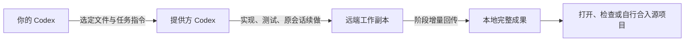

<div align="center">

<h1>
  <picture>
    <source media="(prefers-color-scheme: dark)" srcset="docs/assets/wordmark-dark.svg">
    
  </picture>
</h1>

**让另一台电脑的 Codex 为你工作。**

连接设备，委托任务，持续追加修改。<br>
完整成果保存回本地。

[](https://github.com/mekoand/sub2sub/actions/workflows/ci.yml)
[](CHANGELOG.md)
[](https://nodejs.org/)
[](LICENSE)
[](#当前限制)

**简体中文** · [English](README.en.md)

[开始使用](#快速开始) · [安装指南](docs/install.md) · [使用手册](docs/usage.md) · [问题反馈](https://github.com/mekoand/sub2sub/issues)

</div>

---

sub2sub 是一个 Codex 插件。它让你在自己的对话里，把选定的项目文件和任务交给另一台已授权的电脑，由那台电脑上的 Codex 执行，再将结果保存回本地。

适合把一个边界清楚的实现、文档或分析任务交给另一台设备，并持续追加修改。双方各自管理自己的登录；日常连接通过插件邀请完成，不需要 SSH 密码，也没有中央调度服务。

> **当前版本：0.4.3，实验阶段。** macOS 与 Windows 有实机验证；Linux 尚未实机验收。执行依赖 Codex 的实验性权限接口，**每个提供方同时执行一个任务，每轮最长 30 分钟**。完整边界见[当前限制](#当前限制)。

## 为什么用 sub2sub

| 能力 | 实际行为 |
| --- | --- |
| 邀请配对 | 提供方生成一次性邀请码，使用方在自己的 Codex 中连接 |
| 原任务续做 | 追加指令沿用远端工作副本和原生会话，不必重新解释项目 |
| 先看范围，再传文件 | 展示目标设备、选定文件数量和体积；按设备保存任务文件授权 |
| 增量回传 | 只同步上次成功保存后变化的文件，本地保留完整可用副本 |
| 双方各自设置 | 使用方选默认模型与思考强度；提供方决定开放的模型与保留期限 |
| 清理后仍可续作 | 清理远端工作文件后，可用已保存副本恢复原会话；删除记录或历史另行选择 |
| 成果留在本地 | 查看已保存成果不需要远端在线，源工作区不会被自动覆盖 |

## 一次完整的使用过程

下面是对话示例，不是实际执行记录。具体文件范围由 Codex 在传输前展示。

| 所在设备 | 对 Codex 说 |
| --- | --- |
| 提供方 | “生成 sub2sub 邀请码，让另一台电脑使用。” |
| 使用方 | “连接这个邀请码，命名为工作电脑：`sub2sub:…`” |
| 使用方 | “把当前项目的文档交给工作电脑，做一个离线介绍网页。请在远端完成实现和必要测试。” |
| 使用方 | “继续刚才的任务，增加移动端布局。” |
| 使用方 | “查看最新成果。” |
| 使用方 | “成果已确认，结束任务并清理远端工作副本，保留以后续做的能力。” |



提供方完成任务及质量验证；使用方检查主任务是否完成、成果是否齐全并成功保存。远端任务能调用哪些工具受其执行环境限制，不能默认拥有提供方桌面上的全部插件与浏览器能力。

## 快速开始

### 1. 在两台设备准备环境

- 支持原生插件和 App Server 权限接口的 Codex。当前实机验证基于 Codex 0.152.x。
- Node.js **22 或更新版本**，以及用于获取源码的 Git。
- 提供方使用自己的 ChatGPT 账号登录 Codex；API-key 登录模式不用于委托执行。
- 提供方首次生成共享身份时，需要 PATH 中可执行的 **OpenSSL**。
- 两台设备之间可直连的私有 IPv4 网络；提供方允许所选端口入站，默认 **47631**。

sub2sub 没有第三方 npm 运行依赖，不需要 `npm install`。模型请求仍由提供方的 Codex 服务完成，整个系统不是离线模型服务。

### 2. 获取并安装插件

```sh
git clone https://github.com/mekoand/sub2sub.git
cd sub2sub
```

按[安装指南](docs/install.md)完成对应平台的打包、环境检查和本地 marketplace 安装。Windows 包会写入该设备实际 Node 路径，请在目标 Windows 上准备；macOS 使用随包启动器。

这是源码安装流程，仓库尚不提供“从公共插件目录搜索即安装”的分发承诺。安装后打开**新的 Codex 对话**，确保新技能和工具已载入。

### 3. 配对并派发第一个任务

1. 提供方说“生成 sub2sub 邀请码”，保持承载共享的 Codex 进程运行。
2. 私下发送邀请码。邀请 **10 分钟有效、仅可使用一次**，重新生成会替换旧邀请。
3. 使用方粘贴邀请码、给连接命名，并确认任务文件传输范围。
4. 指定一个明确任务；确认文件预览后执行，阶段结束后取回成果。

模型或思考强度不被目标节点支持时，插件列出实际选项并等待选择，不会静默换模型。

## 设置保持简单

| 身份 | 普通设置 | 高级设置 |
| --- | --- | --- |
| 使用方 | 默认模型、思考强度；所有节点共用，单任务可覆盖 | 输入、结果的字节数与文件数上限 |
| 提供方 | 开放全部当前可用模型，或指定模型列表 | 传输上限、任务保留天数 |

直接说“查看使用方设置”“修改默认模型”“提供方只开放某个模型”或“查看高级设置”。新使用方的代码默认值为 `gpt-5.6-luna / max`；账号实际可用组合会在派发前查询。修改默认值只影响新任务。

默认输入和结果分别限制为 **20 MiB / 2,000 个文件**。输入计算完整副本，结果计算本次变更；两端取较小限制。高级设置最多支持 64 MiB / 10,000 个文件。详细参数见[使用手册](docs/usage.md#设置与查询)。

## 成果、保留与清理

每个阶段取回成果后，本地保留完整任务副本和文字答复。后续“查看成果”使用本地已保存版本；新一轮尚未保存时，会标明当前展示的是旧成果。

| 操作 | 保留与删除范围 |
| --- | --- |
| 保留 `keep` | 按任务已有期限保留，不重新延长期限 |
| 清理工作副本 `workcopy` | 删除远端工作文件和传输载荷；保留原生会话、本地成果及必要恢复信息 |
| 清理任务记录 `records` | 进一步删除 sub2sub 任务记录；不再自动恢复，但保留原生历史 |
| 清理全部 `all` | 进一步删除对应原生会话及其衍生子会话 |

默认在最后一轮结束后闲置 **7 天**具备工作副本清理条件，且必须满足最新必要成果已保存、没有活动或未知执行。共享进程关闭、设备关机或休眠时，不承诺准点清理。原生历史删除始终是单独的明确选择。

删除连接会失去旧任务的续作关联，重新配对不会恢复它；已保存的本地成果仍可查看。详见[生命周期说明](docs/usage.md#任务生命周期)。

## 当前限制

- **局域网直连**：仅私有 IPv4 地址，没有公网中继、IPv6、自动发现、跨设备队列或开机自启。
- **单任务执行**：一个提供方同时一个活动任务。单轮固定 30 分钟，长任务应分阶段；超时先查询并恢复原任务，避免重复派发。
- **任务能力有边界**：执行目录限制在工作副本；任务网络、Web、MCP、应用和浏览器集成关闭。需要联网安装依赖、访问其他项目或使用桌面插件的任务可能无法完成。
- **共享进程需要在线**：停止接收新任务与关闭进程不同；进程退出会中断执行。
- **大体积临时产物可能阻塞回传**：例如浏览器 profile、构建缓存。应整理任务输出或明确调整额度；代码完成不等于成果已交付。
- **Windows 仍有环境差异**：使用原生 `codex.exe` 并从桌面登录会话启动；SSH 系统会话的沙箱初始化、浏览器启动等有已知限制。
- **清理依赖实际权限**：沙箱或宿主审批可能拒绝某些文件操作，插件不会自动扩大权限。

这些是当前实现边界，不以路线图代替已实现功能。[兼容与验证范围](docs/validation.md)区分自动测试、真实双机验证和未覆盖场景。

## 打包

在源码根目录运行，不需要安装 npm 依赖：

```sh
npm run package -- /absolute/new/location/sub2sub
```

父目录须存在，目标目录须尚未创建。打包产物包含插件、双语文档及许可证；在目标 Windows 上运行时，会自动使用该机 Node 路径。注册与安装步骤见[安装指南](docs/install.md)。

## 开发与贡献

```sh
# macOS / Linux 源码检查，不调用真实订阅
npm run check
npm test

# Windows 的独立平台回归
node --test test/platform.test.mjs
```

完整套件使用隔离状态、回环连接和模拟 Codex 协议端。真实订阅冒烟测试是独立的显式操作，不由 CI 自动执行。

项目采用原生 ESM 和 Node 内置模块。入口在 `bin/`，状态与协议实现位于 `lib/`，对话流程位于 `skills/sub2sub/`。详见[架构说明](docs/architecture.md)和[贡献指南](CONTRIBUTING.md)。

欢迎提交包含复现步骤、平台和版本的信息，或针对具体问题发起小范围 PR。请勿在 Issue 中贴邀请码、配对 token 或完整状态目录。

## 文档导航

- [安装、更新与卸载](docs/install.md)
- [对话操作、设置和生命周期](docs/usage.md)
- [故障排查](docs/troubleshooting.md)
- [架构与模块](docs/architecture.md)
- [验证范围与已知限制](docs/validation.md)
- [版本记录](CHANGELOG.md)

## 许可证

[MIT](LICENSE) © 2026 mekoand。

sub2sub 是独立的社区项目，不隶属于 OpenAI。Codex 与 ChatGPT 为其各自权利人的产品及商标。
