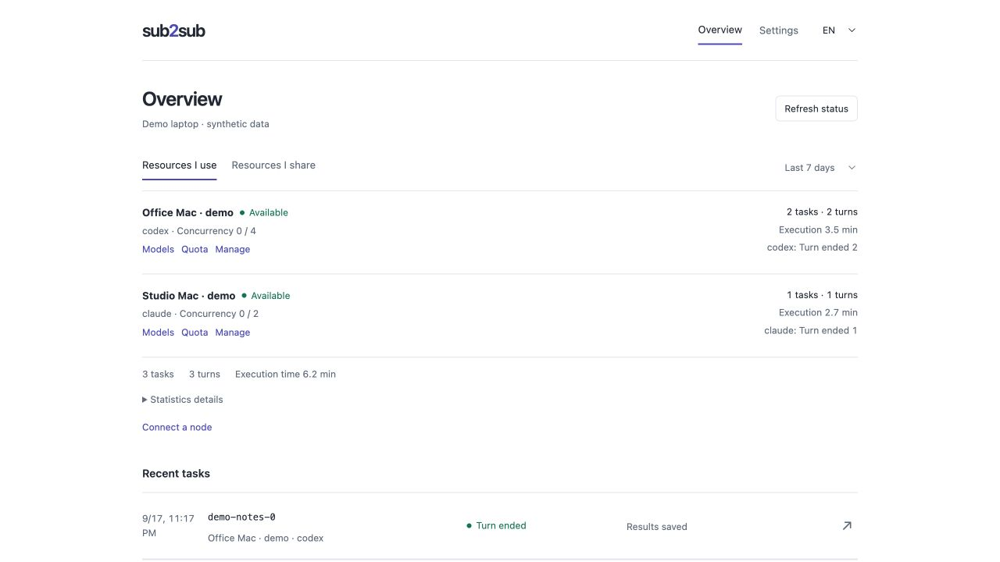

<div align="center">

<h1>
  <picture>
    <source media="(prefers-color-scheme: dark)" srcset="docs/assets/wordmark-dark.svg">
    
  </picture>
</h1>

**更安全、更轻量、更流畅的 AI 资源共享与团队协作方式。**

目前支持 Codex 和 Claude Code，更多工具支持正在开发中。

[](https://github.com/mekoand/sub2sub/actions/workflows/ci.yml)
[](CHANGELOG.md)
[](LICENSE)

[English](README.md) · **简体中文** · [安装](docs/install.md) · [使用手册](docs/usage.md) · [参与贡献](CONTRIBUTING.zh-CN.md) · [安全报告](SECURITY.md)

</div>

sub2sub 连接你自己的设备和队友授权的设备，让你在熟悉的 AI 工具中共享资源、协作完成任务。发送选定的文件，取回答复与成果，再在原对话中继续修改。账号凭据由各自保管，共享范围由共享端掌握。

**共享端 Host** 开放 AI 能力、执行授权任务；**使用端 Client** 发起任务、接收成果。同一台设备可以兼任两种角色。私网内可直接连接；跨网络连接需要双方主动开启服务。

先[安装插件](#安装)，再[连接两台设备](#连接工作节点)。第一次使用时，可以只发送一份不含敏感信息的短文本，要求整理为摘要。



*当前管理页使用合成设备名和任务记录展示，不包含真实账号或任务内容。*

## 它能帮你做什么

- **选择任务交给谁。** 从已配对节点中选择执行工具和可用模型，也可以按需查询 Codex 节点的剩余额度。可主动开启[按顺序自动选择共享端](docs/usage.md#自动选择共享端)，仅在新任务提交前选择；提交后不自动换端。
- **文件和答复一起取回。** 本地获得包含输入与最新修改的完整工作副本，源项目由你决定何时采用修改；保存的成果离线也能看。
- **在原任务中追加修改。** 继续说“把手机排版也调整一下”，共享端沿用原来的工作文件和会话。
- **会话展示可选。** 新建 Codex 委托默认在每轮结束后归档，续作时恢复；共享端可设置保留在客户端任务列表中。只影响新任务，工作副本清理规则不变。详见[会话展示](docs/usage.md#委托会话展示)。
- **共享由共享端控制。** 共享端决定授权连接、执行工具与开放模型，可以随时停止接收新任务。每个节点默认最多同时执行 4 项任务，可调整上限；名额满时不排队，调低上限不会中断已有任务。

适合资料整理、离线页面、代码修改这类输入与产物明确的工作。任务在独立副本中执行，当前不启用任务联网、MCP、应用或浏览器集成；共享端会检查任务所需环境；默认允许使用端补充本地验证，明确要求在共享端运行的任务仍遵从原要求。必需检查通过后才能算完整完成。[执行范围与限制](docs/usage.md#派发和追加需求)

## 安装

发起任务和接收任务的电脑都需要安装。按你准备用 sub2sub 的应用选择命令，并先登录该应用；接收任务的设备可以另外选择执行工具。安装包自带 Node 和证书生成能力，无需运行 npm。

### 让 AI 帮你安装

把下面这段话发给你正在使用的 Codex 或 Claude Code：

> 请按照 https://github.com/mekoand/sub2sub 的安装说明，为我当前使用的应用安装 sub2sub 最新正式版。请核对并报告安装版本，确认是最新正式版且已启用，再告诉我如何重启，以及第一次怎样使用。

助手会根据当前宿主和系统选择安装方法；无法执行安装时，可让它给出对应命令。安装后仍需按提示重启应用。你也可以按下方步骤手动安装。

### Codex

**macOS · 终端**（自动识别 Apple Silicon / Intel）

```sh
/bin/bash -o pipefail -c 'curl -fsSL https://github.com/mekoand/sub2sub/releases/latest/download/install.sh | /bin/bash'
```

**Windows x64 · PowerShell**

```powershell
irm https://github.com/mekoand/sub2sub/releases/latest/download/install.ps1 | iex
```

看到 `Installed sub2sub` 后，**完整退出并重新打开 Codex 桌面应用**；CLI 用户退出并重启 Codex。仅关闭窗口或新建对话可能仍加载旧插件。

### Claude Code

**macOS · 终端**（Apple Silicon / Intel）

```sh
/bin/bash -o pipefail -c 'curl -fsSL https://github.com/mekoand/sub2sub/releases/latest/download/install.sh | /bin/bash -s -- claude'
```

**Windows x64 · PowerShell**

```powershell
& ([scriptblock]::Create((irm https://github.com/mekoand/sub2sub/releases/latest/download/install.ps1))) -Target claude
```

安装后启动**新的 Claude Code 会话**。只发起任务的设备无需安装 Codex。接收方使用 Claude 执行目前需要 macOS；Windows 上的 Claude Code 可以发起委托。[版本要求与自定义路径](docs/install.md#claude-code)

### 确认已加载

重启应用后，在对话中说：

> 查询 sub2sub 状态和版本，不修改设置。

确认当前对话加载的版本。尚未开始接收任务时，共享节点处于停止状态是正常的。首次使用按提示检查设置；这一步不会自动开启跨网服务，也不等于文件传输授权。

以后在安装它的应用中说“升级 sub2sub”即可。配对和已保存成果会保留；重启应用后加载新版，运行中的共享节点则要等空闲后明确退出并重新开启。[安装、更新与故障排查](docs/install.md)

## 连接工作节点

设备处于不同网络时，先分别在双方设备上要求**开启跨网络连接服务**，该服务默认关闭。设备在私网内已可互通时，保持关闭即可。[跨网设置与旧连接迁移](docs/install.md#跨网络连接)

在准备**接收任务**的电脑上：

> 生成 sub2sub 邀请码。

在准备**发起任务**的电脑上粘贴邀请码：

> 连接这个 sub2sub 邀请码，把它叫作「办公室 Mac」。

按提示确认文件传输范围，并给连接取一个容易识别的名字。开启共享后节点独立运行，可以关闭管理对话；执行期间保持接收方电脑唤醒并联网。

## 先试一个小任务

在当前工作目录中选一个不含敏感内容的短文本文件，例如 `notes.txt`，然后说：

> 用 sub2sub 只把 notes.txt 交给「办公室 Mac」，整理成 summary.md，返回这个文件和简短答复。

任务完成后，打开本地 `summary.md` 链接。答复和文件都保存到本机才算这次委托完成；连接成功本身不代表任务完成。源文件保持不变。

需要修改时，在原对话继续说：

> 继续这个任务，把 summary.md 再精简一点，并保存最新成果到本地。

接收方沿用同一任务和工作文件。已经保存的成果在对方离线后仍可打开。[委托、成果与清理](docs/usage.md)

## 示例：从 Codex 委托给 Claude

队友在 Mac 上登录了 Claude Code，并通过 sub2sub 授权你使用。你在自己的 Codex 对话中完成配对，把连接命名为「办公室 Mac」，随后把文档整理任务交过去：

> 用 sub2sub 把 docs 目录交给「办公室 Mac」，做成带搜索的离线帮助站点，检查链接并返回完整文件。

成果会保存到本地。打开看看，发现手机上的排版还可以再改，继续说：

> 继续这个任务，按主题分组页面，并调整手机上的排版。

共享端沿用同一任务的工作文件和 Claude 会话，只回传变化的文件；你在本地得到完整副本。确认成果后：

> 保存最新成果，结束任务并清理远端工作副本。

源项目由你决定何时采用这些修改。节点离线后，已经保存的文件仍可打开。[使用、设置与清理](docs/usage.md)

## 一个轻巧的管理页

在对话里说：

> 打开 sub2sub 管理页。

简洁的本机管理页，集中查看节点、任务和已保存成果，也能配对、调整设置、按需查询 Codex 额度。近 7 天或 30 天的资源统计，帮你看看任务交给了谁、跑了几轮、用了多少执行时间。还可按轮次、实际模型和来源查看原生用量，保留缺失项说明并导出 JSON，不计算价格。

管理页默认开启，可以随时关闭；它复用插件进程，不增加后台服务，也不会自动打开浏览器。任务指令和追问继续留在原对话里。[管理页与统计说明](docs/usage.md#本机管理页与统计)

## 跨网络使用

跨网络连接服务默认关闭。双方主动开启后，照常交换一个邀请码即可，用户无需为每项任务选择连接方式。系统优先尝试私网直连，必要时通过内置 Tailcat 连接，可使用公共中继。旧连接保持原方式，用户可以主动迁移。[开启与迁移说明](docs/install.md#跨网络连接)

## 兼容性

管理插件的应用是使用插件的入口；Host 的执行工具单独选择。

| 系统 | 管理应用 / Client 使用端 | Host 执行工具 | 验证与限制 |
| --- | --- | --- | --- |
| macOS（Apple Silicon / Intel 安装包） | Codex Desktop、Codex CLI、Claude Code | Codex 或 Claude Code | Apple Silicon 已验证真实任务和 Mac 间传输；Intel 安装尚未完成同等实机验证。 |
| Windows x64 | 提供 Codex 和 Claude Code 安装入口 | Codex；暂不支持 Claude 执行 | 已验证原生安装、平台测试及 Mac 到 Windows 的 Codex 任务；Windows Client 的同等端到端验证尚不完整。 |
| Linux | 仅源码开发；暂无正式安装器或发行包 | 不声明为已支持的 Host 平台 | Linux 源码 CI 通过，不等于完成发行或实机支持。 |

WorkBuddy 和其他管理应用尚未实测。[版本与验证详情](docs/validation.md)

当前正式版为 [v0.9.2](https://github.com/mekoand/sub2sub/releases/tag/v0.9.2)。`main` 可能包含尚未发布的改动，包括本文使用的 Host/Client 术语和执行环境指引。连接 Token 预算、到期完整清理和自动选择 Host 分别在 [#60](https://github.com/mekoand/sub2sub/issues/60)、[#61](https://github.com/mekoand/sub2sub/issues/61)、[#62](https://github.com/mekoand/sub2sub/issues/62) 跟踪，不属于 v0.9.2；使用前请核对[发行说明](https://github.com/mekoand/sub2sub/releases)。

## 开发

```sh
npm ci --omit=optional --ignore-scripts
npm run check
npm test
```

[开发与打包](docs/development.md) · [架构](docs/architecture.md) · [贡献指南](CONTRIBUTING.zh-CN.md) · [版本记录](CHANGELOG.md)

遇到问题，直接在原对话里说“帮我排查 sub2sub 的这个问题”。需要反馈时，再说“把这个问题提交到 GitHub”：助手会整理公开草稿并查重，使用宿主已有能力提交；没有提交能力时，把草稿交给你。[故障排查](docs/troubleshooting.md) · [Issues](https://github.com/mekoand/sub2sub/issues)

## 参与贡献与反馈

欢迎改进文档和翻译、复现缺陷、提交小修复，或提出工具适配方案。请先阅读[贡献指南](CONTRIBUTING.zh-CN.md)（[English](CONTRIBUTING.md)）。缺陷、建议和后续规划统一在 [Issues](https://github.com/mekoand/sub2sub/issues) 跟踪；安全漏洞使用[私密报告入口](SECURITY.md)。更新见[版本记录](CHANGELOG.md)，授权见 [MIT 许可证](LICENSE)。

sub2sub 是社区维护项目，请尊重参与者，并根据事实讨论。使用者应遵守所用 AI 服务的条款。本项目不是 OpenAI 或 Anthropic 的官方产品，也不代表上游官方背书。

[MIT](LICENSE) © 2026 mekoand
