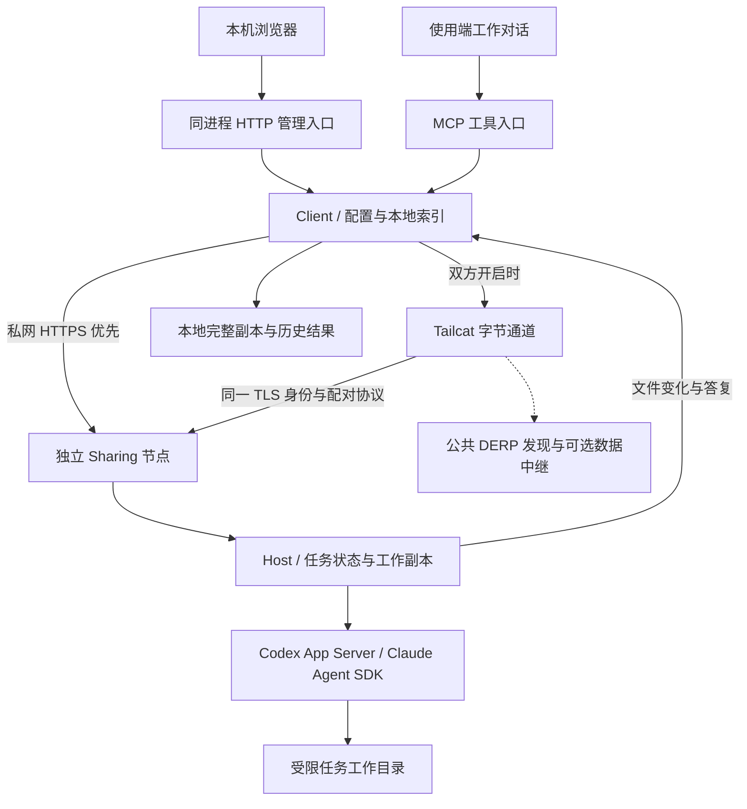

# 架构

[返回 README](../README.zh-CN.md)

sub2sub 是一个通过 stdio 暴露工具的本地 MCP 服务。使用端和共享端运行同一套程序，私网 HTTPS 或主动开启的 Tailcat 通道连接两端，共享端节点独立运行，使用当前选择的 Codex App Server 或 Claude Agent SDK 执行任务。

## 模块

| 路径 | 职责 |
| --- | --- |
| `bin/mcp.mjs` | MCP工具注册、参数边界、调用与进度通知 |
| `lib/tools.mjs` | MCP 与网页复用的工具定义与参数校验 |
| `lib/web.mjs` / `web/` | 同进程的本机 HTTP 入口与原生 HTML/CSS/JS 管理页 |
| `lib/statistics.mjs` | 从现存任务轮次记录汇总，不建独立历史库 |
| `bin/share.mjs` | 独立节点入口；沿用现有共享状态与控制接口 |
| `lib/windows-node.mjs` | Windows 一次性进程启动，脱离管理宿主的进程组 |
| `bin/launch.sh` | macOS/POSIX Node运行时发现及启动 |
| `lib/client.mjs` | 使用端流程、任务索引、结果保存和续做 |
| `lib/lan.mjs` | HTTPS共享、邀请码、配对、并发名额及到期检查 |
| `lib/tailcat.mjs` / `transport/tailcat/` | 固定服务的 Tailcat helper、进程生命周期和发行完整性校验 |
| `lib/provider.mjs` | 共享端任务状态、执行、同步确认、恢复和清理 |
| `lib/codex.mjs` | App Server握手、原生会话、轮次事件和执行权限 |
| `lib/claude.mjs` | 官方 SDK 的模型查询、Bash 沙箱执行及会话管理 |
| `lib/codex-read.mjs` / `lib/usage.mjs` | 官方只读模型与账号额度查询 |
| `lib/codex-history.mjs` | 对应原生会话及子会话的历史管理 |
| `lib/files.mjs` / `lib/sync.mjs` | 文件选择、变化收集、完整本地副本生成 |
| `lib/config.mjs` / `lib/models.mjs` | 配置、可执行文件和模型能力发现 |
| `lib/limits.mjs` / `lib/lock.mjs` | 传输限制与本地进程互斥 |
| `skills/sub2sub/` | 面向Codex的对话操作指引 |
| `test/` | 使用临时状态和模拟协议端的自动回归 |

## 数据流

输入快照将元数据与冻结文件分开存储；已有内嵌 base64 的快照仍可读取。双方通过能力查询协商分块传输，文件内容按有界块读写、接收后校验大小及 SHA-256。单条元数据记录有边界，文件和列表逐项发送，不设置固定总量上限。接收临时文件仅在完整保存后释放，未完成的传输不确认保存；上传采用空闲超时，不按总时长截断持续有进展的传输。旧节点继续使用原协议及有限设置。

首次上传冻结输入快照，并为委托建立独立工作副本。每轮执行使用一个原生执行连接；持久化的原生会话ID使下一轮能够恢复上下文。

回传比较上次确认保存的文件清单，返回新增、修改和删除。使用端先完成本地副本与索引保存，再向共享端确认。无文件变化时复用已有完整副本，有变化时创建独立副本；不自动覆盖使用端源项目。

清理工作副本保留续作所需的最少状态。下次续做从已保存完整副本恢复，并检查完整输入上限。清理记录和删除原生历史是更大的独立选择。

## 执行边界

共享使用插件生成的身份和邀请中的证书指纹建立对端关联。共享端订阅登录由本机所选执行工具持有，不随工作副本传输。

任务文件权限由执行工具的系统沙箱约束，只写工作副本，最小系统环境只读。Codex 使用权限配置；Claude 仅暴露 Bash，所有文件操作经过官方 Bash 沙箱，缓存使用既有任务缓存目录。任务网络及宿主插件/应用集成关闭。这个边界不是虚拟机；实际系统行为与可用能力需要验证，不能只从配置推断所有操作必定成功。

环境检查由执行工具在当前任务开头完成，只检查该任务实际需要且沙箱内可用的工具和依赖；不增加模型轮次、全量扫描、全局设置或每次派发确认。默认由共享端完成修改及可用检查，使用端在独立验证副本中按本地权限和任务授权补充缺失验证，插件保存的同步与恢复副本保持原样。任务明确要求在共享端执行或验证时，该要求仍是完成条件。缺口阻止有效工作、要求无法满足或使用端也无法验证时，说明原因并等待用户选择准备环境、更换共享端或调整范围，不自动降低标准。交付完整与验证通过分别报告；以上是任务指引，不改变执行沙箱或任务状态协议。

共享端默认最多同时执行 4 项任务，节点总上限可配置；先到先用、满额拒绝，同一任务不能同时执行两轮。调低上限让已有任务完成，名额低于新上限后才接收新任务，不要求重启。管理进程关闭不影响节点；停止共享只暂停接单，退出节点要求活动轮次先结束或取消。手动重启保留原身份、任务和设置，电脑重启后需手动开启共享。

额度查询由实际执行节点使用自身账号完成，返回当前窗口与采集时间，不缓存旧账号数字，也不负责自动选节点。

Client 的自动选择默认关闭，复用使用端设置保存有序候选。新任务未指定共享端时，按序检查已有文件授权、节点状态、指定执行工具、模型与思考强度、已知输入限制，以及可用的连接预算摘要；不做环境扫描或追加模型执行。选择首个符合条件的节点后只进入一次既有提交流程，接单拒绝或结果不明也不改投其他节点。Host 仍独立执行最终接单检查；后续操作沿用原任务连接与身份。候选列表不替代传输授权，预算摘要缺失不代表余额充足。

没有自建中央协调服务或持久任务队列。日常流程使用同一邀请码和配对协议，私网 HTTPS 优先；默认关闭的 Tailcat 服务在双方主动开启后可用于跨网，启动依赖公共 DERP 发现，数据可经直接通道或中继。只有 HTTP 请求尚未发出时的连接失败才允许尝试另一通道，不重放已提交的任务。SSH 和本地 transport 保留用于开发与兼容验证。详见[跨网开发说明](development/cross-network.md)。

本机网页默认随 MCP 初始化，独立共享入口不启动网页。随机 loopback 端口与内存令牌属于当前 MCP 进程；令牌放在私密链接片段中，API 校验令牌及 Host/Origin，不开放跨域。页面复用 Client 操作和既有确认/授权/清理边界，不提供执行任务的接口。静态资源随包分发，无额外运行依赖、构建框架或数据库；成果仅在已保存文件清单内按文本或附件返回，拒绝路径穿越及符号链接。

每轮的开始、结束、状态、单调时钟时长和原生模型用量写入共享端现有 state.json，使用端接收执行或成果时更新现有索引。每轮从执行期间已有原生事件计量，不追加模型或账户查询；分类保留来源口径，累计事件去重，模型无法归属及缺失字段保持未知。旧记录缺少计量时保持未知。工作副本清理不删除这些字段；明确清理记录则删除对应统计。诊断反馈只补充 Skill 指引，复用既有查询和宿主的 GitHub 能力。

## 修改原则

保持小而明确的模块边界。对输入、文件、进程和网络边界校验；对内部已建立的契约避免重复防御。错误保留上下文，不能把下载、保存、清理或执行失败转换为成功。新行为用与风险匹配的回归验证，不为了抽象重写现有流程。
