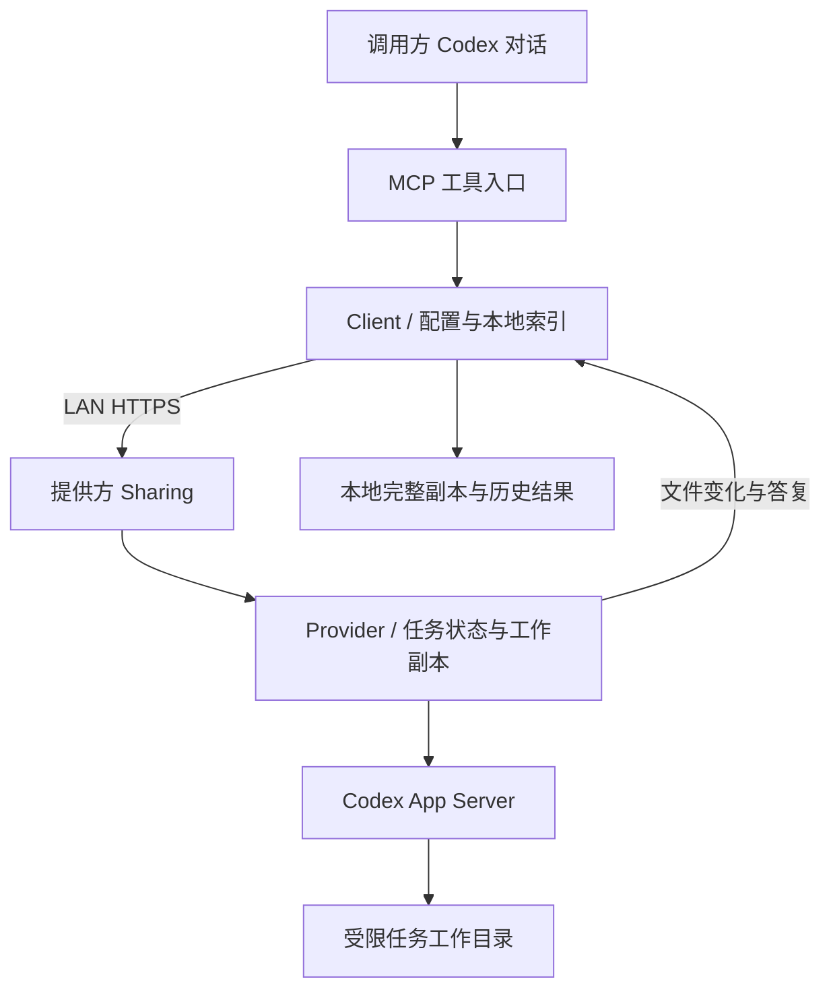

# 架构

[返回 README](../README.md)

sub2sub 是一个通过 stdio 暴露工具的本地 MCP 服务。调用方和提供方运行同一套程序，LAN协议连接两端，提供方通过自己的 Codex App Server 执行任务。

## 模块

| 路径 | 职责 |
| --- | --- |
| `bin/mcp.mjs` | MCP工具注册、参数边界、调用与进度通知 |
| `bin/launch.sh` | macOS/POSIX Node运行时发现及启动 |
| `lib/client.mjs` | 调用方流程、任务索引、结果保存和续做 |
| `lib/lan.mjs` | HTTPS共享、邀请码、配对、单任务接入及到期检查 |
| `lib/provider.mjs` | 提供方任务状态、执行、同步确认、恢复和清理 |
| `lib/codex.mjs` | App Server握手、原生会话、轮次事件和执行权限 |
| `lib/codex-history.mjs` | 对应原生会话及子会话的历史管理 |
| `lib/files.mjs` / `lib/sync.mjs` | 文件选择、变化收集、完整本地副本生成 |
| `lib/config.mjs` / `lib/models.mjs` | 配置、可执行文件和模型能力发现 |
| `lib/limits.mjs` / `lib/lock.mjs` | 传输限制与本地进程互斥 |
| `skills/sub2sub/` | 面向Codex的对话操作指引 |
| `test/` | 使用临时状态和模拟协议端的自动回归 |

## 数据流

首次上传冻结输入快照，并为委托建立独立工作副本。每轮执行使用一个App Server连接；持久化的原生会话ID使下一轮能够恢复上下文。

回传比较上次确认保存的文件清单，返回新增、修改和删除。调用方先完成本地副本与索引保存，再向提供方确认。无文件变化时复用已有完整副本，有变化时创建独立副本；不自动覆盖调用方源项目。

清理工作副本保留续作所需的最少状态。下次续做从已保存完整副本恢复，并检查完整输入上限。清理记录和删除原生历史是更大的独立选择。

## 执行边界

共享使用插件生成的身份和邀请中的证书指纹建立对端关联。提供方ChatGPT登录由本机Codex持有，不随工作副本传输。

任务的文件权限由Codex系统沙箱约束，只写工作副本，最小系统环境只读。任务网络及宿主插件/应用集成关闭。这个边界不是虚拟机；实际系统行为与可用能力需要验证，不能只从配置推断所有操作必定成功。

提供方同一时刻只接受一个活动任务。没有中央服务、持久队列、自动故障转移或自动无限重试。SSH和本地transport保留用于开发与兼容验证，用户日常流程使用LAN邀请配对。

## 修改原则

保持小而明确的模块边界。对输入、文件、进程和网络边界校验；对内部已建立的契约避免重复防御。错误保留上下文，不能把下载、保存、清理或执行失败转换为成功。新行为用与风险匹配的回归验证，不为了抽象重写现有流程。
